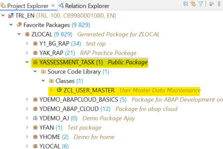

# Pre-requisites
This task is available on the **SAP ABAP cloud trial enviroment(aka Steampunk)** and the expectation is that the developer uses the same enviroment to fulfill/develop the provided requirements.
The ABAP cloud environment uses the ABAP cloud language version/model by default. 

What is ABAP Cloud? It is the new ABAP development model for building cloud-enabled business applications, services and extensions.
For more information on ABAP cloud, read this [blog](https://community.sap.com/t5/technology-blogs-by-sap/abap-cloud-what-does-it-comprise/ba-p/13563607)

Without reading deepely into the above blog post, what do you need to know about ABAP cloud in relation to this task?
- In ABAP cloud SAP has restricted some of the language elements i.e You cannot use **REPORT**, **WRITE**, **SELECT** from a standard table etc
- Use this link to check which language elements are allowed in [ABAP cloud](https://help.sap.com/doc/abapdocu_cp_index_htm/CLOUD/en-US/index.htm?file=abenrestricted_abap_elements.htm)

How to access the SAP ABAP cloud trial enviroment? follow the steps in the below tutorial (**When creating a BTP trial account ensure to select Singapore as the Region!!**)   
**NB: The SAP ABAP cloud trial enviroment only allows Eclipse as an IDE to do your ABAP development**   
[Connecting ABAP Cloud Project in Eclipse with SAP BTP Cockpit (Trial Account)](https://www.linkedin.com/pulse/connecting-abap-cloud-project-eclipse-sap-btp-cockpit-castro-cholan-d33fe/)

# Requirement
**User Master Data Maintenance**

You have a requirement to complete a solution that was started by another developer. The requirement is to develop an ABAP class that performs CRUD operations for the User Master Data. 
The previous developer had already created a skeleton class ZCL_USER_MASTER (can be found in package YASSESSMENT_TASK in the ABAP trial environment). 

1. Your task is to complete the development by: 
-	Creating a corresponding table to store the data (i.e ZUSER_MASTER).
-	Completing the class with all the required logic in the CRUD methods
-	Performing error handling after every Operation
 
2. In your team you have been discussing the possibility of creating an OData service strictly from Eclipse without using an SAP Backend. 
   For knowledge sharing purposes, you have been tasked to create a CDS view for the table you created above (ZUSER_MASTER) and expose/publish it as an OData service.

3. Lastly, to demonstrate the usability of the OData service, create an HTTP ABAP class (API) to consume the above OData service and GET all the users in the table.
